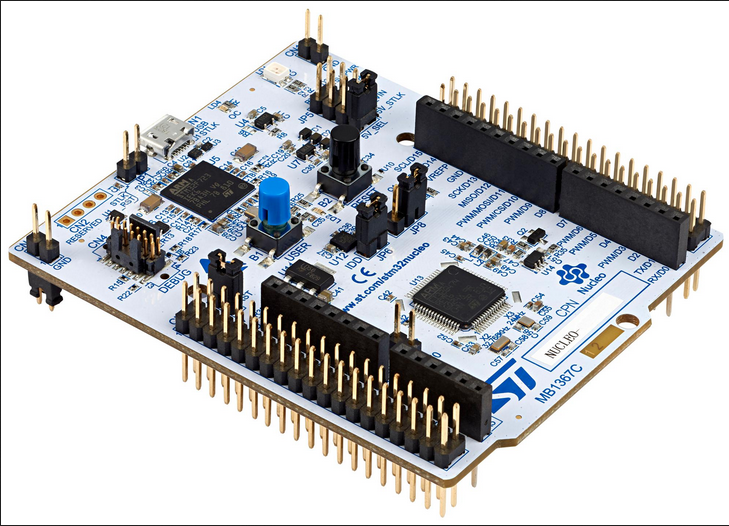

# stm32-nucleo-g491re
Tutorials repo for STM32 nucleo-g491re board.

STM32 Necleo-G491RE bo
Common features:-
--

STM32 microcontroller in an LQFP64 or LQFP48 package

- user LED shared with ARDUINO®
- user and 1 reset push-buttons
- 32.768 kHz crystal oscillator

Board connectors:
---
- ARDUINO® Uno V3 expansion connector
- ST morpho extension pin headers for full access to all STM32 I/Os
  Flexible power-supply options: ST-LINK USB VBUS or external sources
- On-board ST-LINK debugger/programmer with USB re-enumeration
  capability: mass storage, Virtual COM port, and debug port
- Comprehensive free software libraries and examples available with the  STM32Cube MCU Package
- Support of a wide choice of Integrated Development Environments (IDEs) including IAR Embedded Workbench®, MDK-ARM, and STM32CubeIDE

Board-specific features 
---

- External SMPS to generate Vcore logic supply
- 24 MHz or 48 MHz HSE
- User USB Device full speed, or USB SNK/UFP full speed
- Cryptography

Board connectors:
---

- External SMPS experimentation dedicated connector
- USB Type-C®, Micro-B, or Mini-B connector for the ST-LINK
- USB Type-C® user connector
- MIPI® debug connector